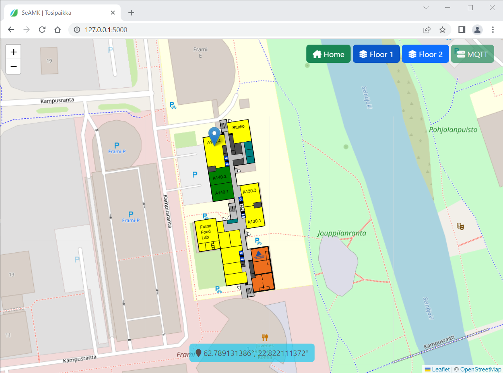
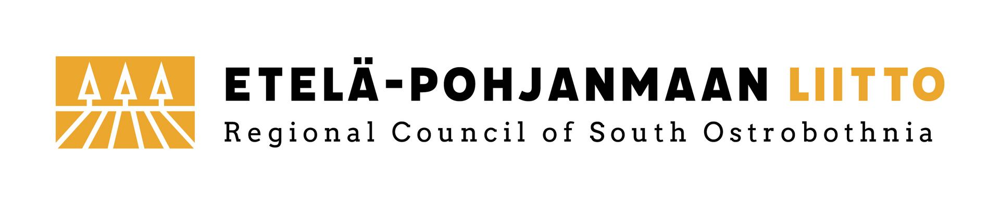

# Sisätilapaikannus

[](https://zenodo.org/badge/latestdoi/598501916)

Yksinkertainen verkkosovellus, jolla voidaan visualisoida käyttäjän sijaintia Frami A -rakennuksen ensimmäisessä ja toisessa kerroksessa. Sovellus vastaanottaa käyttäjän sijainnin ammattikorkeakoulun MQTT-palvelimelta.

## Riippuvuudet

Sovellus käyttää palvelinpuolella [Flask](https://flask.palletsprojects.com/en/2.2.x/)-kirjastoa. Se voidaan asentaa komennolla:

```
pip install Flask
```

## Ajo

Huomautus: sovellus saa yhteyden koulun MQTT-palvelimeen vain kun tietokone, jolla sovellusta ajetaan, on yhteydessä koulun sisäverkkoon.

Käynnistä sovellus alla olevalla komennolla.

```
python app.py
```

Mene sitten verkkoselaimella osoitteeseen http://127.0.0.1:5000.



Toiminnot
* Plus-painike tarkentaa karttaa
* Miinus-painike loitontaa karttaa
* Home-painike keskittää kartan Frami A -rakennukseen
* Floor 1 -painike näyttää Frami A:n 1. kerroksen pohjapiirroksen
* Floor 2 -painike näyttää Frami A:n 2. kerroksen pohjapiirroksen

Karttaa voidaan zoomata myös hiiren rullalla. Huomaa kuitenkin, että suurimmilla tarkkuuksilla OpenStreetMap-karttaa ei ole saatavilla.

Oikealla yläkulmassa näytetään yhteyden tila koulun MQTT-palvelimeen: painike on vihreä, jos yhteys on kunnossa ja punainen yhteyden ollessa poikki.

Käyttäjän tai tägin koordinaatit näytetään verkkosivun alalaidassa keskellä.

Sovellus odottaa paikkatiedon olevan muodossa:

```
{"floor": myFloorNum, "lat": myLatitude, "lon": myLongitude}
```

Kerroksen numero on kokonaisluku, kun taas pituus- ja leveysasteet ovat desimaalilukuja.

Sulje sovellus painamalla Ctrl+c.

## Tekijätiedot

Hannu Hakalahti, Asiantuntija TKI, Seinäjoen ammattikorkeakoulu

## TosiPaikka-hanke

Tämä sovellus on kehitetty osana Tosiaikaisen paikkadatan hyödyntäminen teollisuudessa (TosiPaikka) -hanketta, jota rahoittaa Etelä-Pohjanmaan liitto (EAKR). Lisätietoja hankkeesta löytyy hankkeen [kotisivuilta](https://projektit.seamk.fi/alykkaat-teknologiat/tosipaikka/).



---


